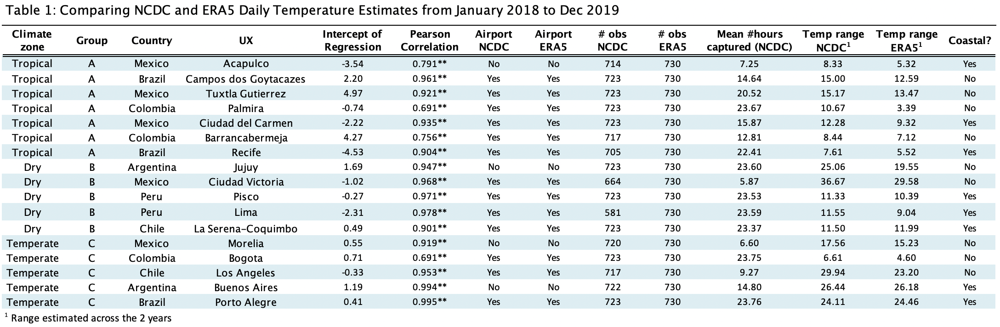

# Validation ERA5 with NCDC weather station
## Sample of 371 Latin American Cities across Koeppen Climate Zones 

Many researchers involved in SALURBAL are interested in using historical temperature reanalysis data. For that reason, we validated the product ERA5 hourly data on single levels from ECWF with NCDC weather station data across different Koeppen climate regions represented in SALURBAL cities. As a brief overview, from the 371 cities, 166 are categorized as tropical (group A), 79 as dry (group B), 125 as temperate (group C) and 1 as polar (group E). No continental climate zones (group D) are represented in SALURBAL cities.

In order to carry out the validation process, we examined daily average temperature data over 2 years, from January 1, 2018 to December 31, 2019. The data product for NCDC is “Global Summary of the Day” and captures a minimum of 4 observations per day. The data product for ERA5 is “t2m” and has an hourly, 30 km scale. In order to homologate these two data sources, we specify if the NCDC data is produced by a weather station in an airport, the mean of number of hourly observations per day, and the number of values captured in the 2 year period.

From the 371 cities, 17 cities were selected: 7 in tropical, 5 in dry, and 5 in temperate zones. From the 17 cities, 7 are coastal to have an idea of how correlated are pixels that can be impacted by the presence of water.

Table 1 describes the relationship between both datasets:

For data processing, please view the Jupyter notebook and the folder containing the temperature data [here](https://github.com/ifarah/salurbal_era5_ncdc/blob/master/data_processing.ipynb). 

### Access to raw data:
- [ERA5 hourly data on single levels](https://cds.climate.copernicus.eu/cdsapp#!/dataset/reanalysis-era5-single-levels?tab=overview)
- [NCDC Daily Summary of the Day - new version](https://www.ncei.noaa.gov/access/search/data-search/global-summary-of-the-day)
- [NCDC Daily Summary of the Day](https://www7.ncdc.noaa.gov/CDO/cdoselect.cmd?datasetabbv=GSOD&countryabbv=&georegionabbv=)

### View plot trends by city:
[PLOTS](https://github.com/ifarah/salurbal_era5_ncdc/blob/master/output/val_plots.pdf)

